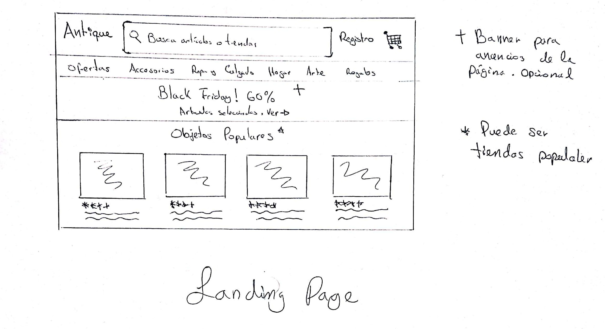
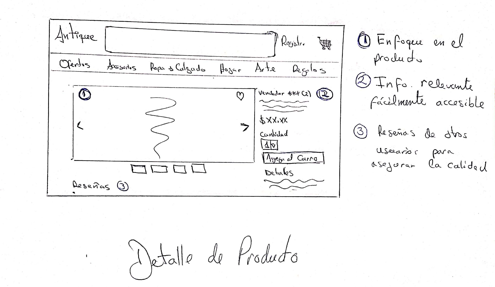
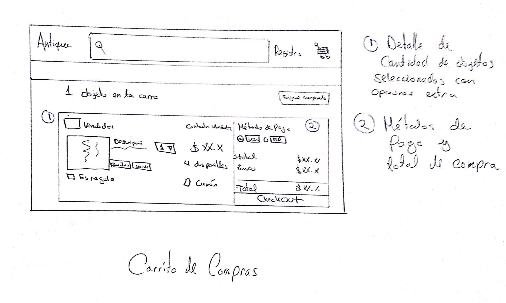
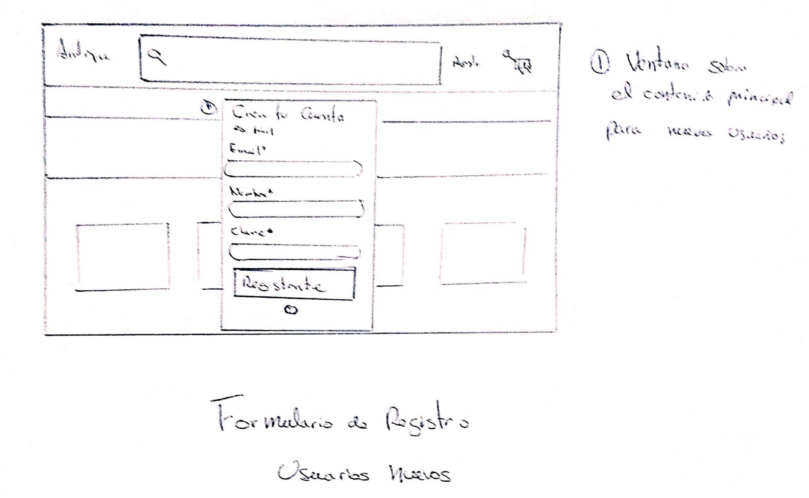
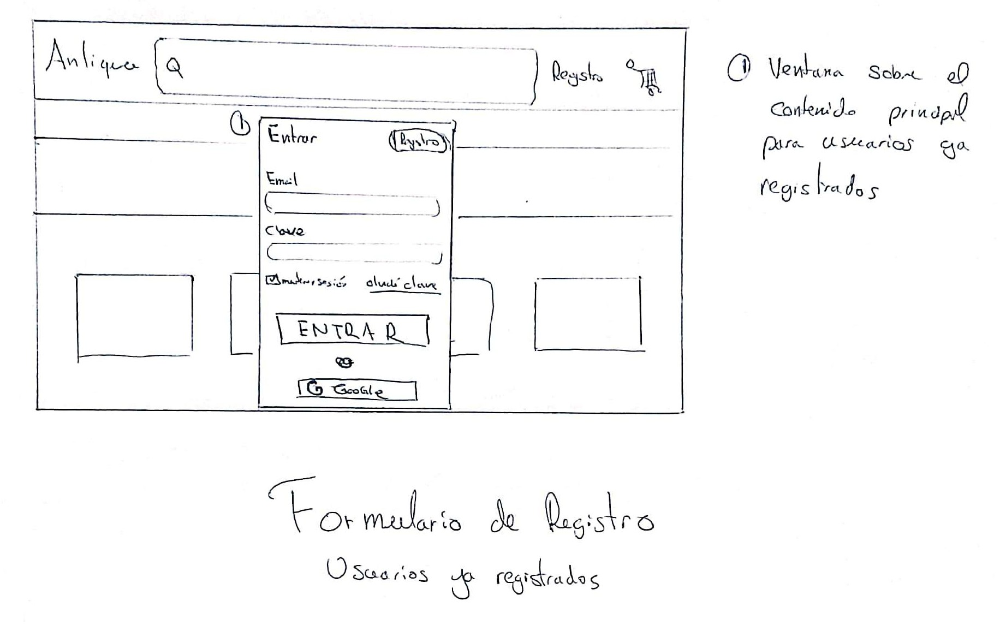

# Antique

El objetivo de este marketplace es conectar objetos unicos antiguos y objetos realizados con el talento de los artesanos que hacen vida en la ciudad de Buenos Aires, con todas las personas que buscan llenar su hogar de piezas originales hechas a mano o articulos antiguos de colección o de gustos extravagantes.

Ahora un pequña pausa publicitaria:

```
Si sos amante de lo retro, coleccionista o simplemente tenes buen gusto, este es el sitio para vos. 
Tenemos luminaria, muebles, joyas y muchos mas artículos de colección, todos a tu alcance en esta
plataforma totalmente gratuita. Al entrar al sitio, te vas a encontrar con un e-commerce seguro que te conecta con la comunidad para que compres, vendas o intercambies a tu gusto, tanto productos nuevos como usados haciéndolo rápido y fácil para cualquier usuario.
```

El sitio va a estar enfocado en hacer que la experiencia del vendedor sea lo más intuitiva y fácil posible, con el fin de llenar de una gran variedad de oferta la página.

## SITIOS DE REFERENCIA:

1- https://www.mercadolibre.com.ar/

2- https://www.todocoleccion.net/

3- https://antiguedadessantelmo.com/

4- http://www.elviejofarol.com.ar/

5- https://www.olx.com.ar/

## Bocetos

### Home


### Detalle de Producto



### Carrito de Compras



### Formulario de Registro

#### Usuarios Nuevos



#### Usuarios Registrados


